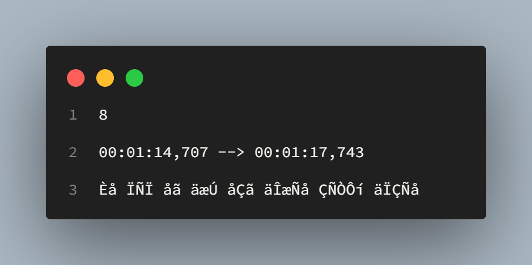
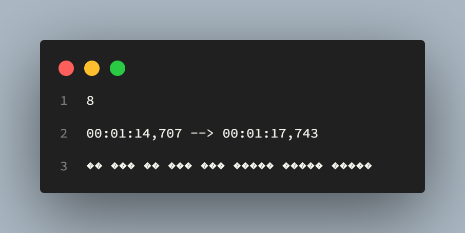
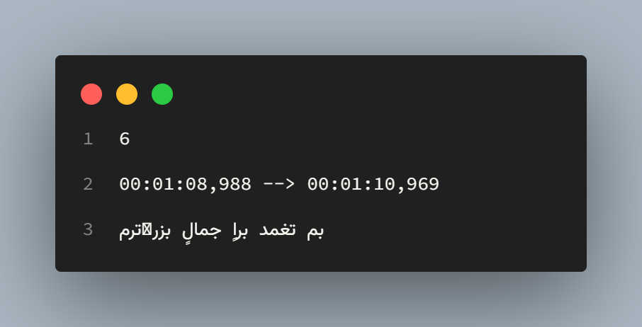
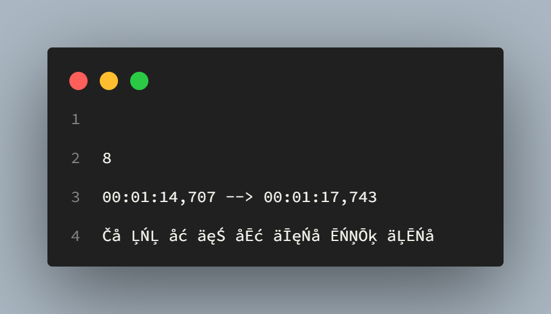
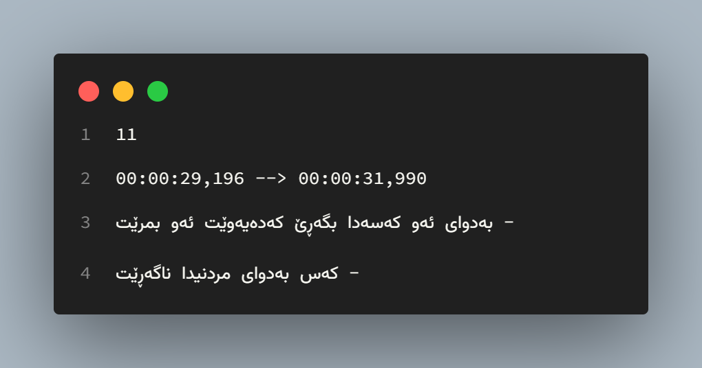
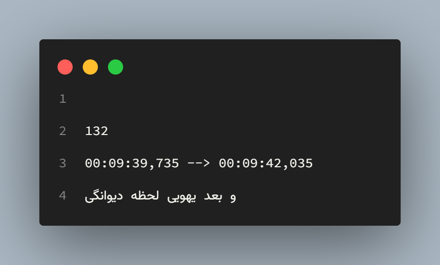

# Subtitle Fixer

The **Subtitle Fixer** is a simple tool that helps you fix subtitles in *Kurdish (ckb)*, *Persian*, and *Arabic*.
If you have ever encountered issues (*see below images*) when watching a movie with its subtitles, you have come to the right place to find a solution.

##### The following images are examples of subtitle files that require fixing









#### NOTE:
Only implement these codes on subtitle files that have issues. If you are proficient in Python and Unicode, you can use the necessary encodings for your files.

## How to Use
- Clone the repo
- Make sure all your subtitles are in the same directory as the repo
- Create a new file with a `.py` extension (e.g. `example.py`) and copy the provided code into it
```python
# -*- coding: utf-8 -*-

# import essential modules
import io
import sys
from pathlib import Path

# solve encoding problems
sys.stdout = io.TextIOWrapper(sys.stdout.buffer, encoding="utf-8")
sys.stdin = io.TextIOWrapper(sys.stdin.buffer, encoding="utf-8")

# import subtitle_fixer module
from subtitle_fixer import Subtitle_Fixer

# get current directory
current_directory = Path(__file__).parent

# get all files in current directory
srt_files = current_directory.iterdir()

# make an instance of Subtitle_Fixer class
subt = Subtitle_Fixer()

# find subtitles based on their extensions
# and fix encoding of all subtitle files
fix = [
    subt.fix_encoding(s)
    for s in srt_files
    if str(s.name).split(".")[-1] in subt.subtitle_extensions
]
```
- Run the file using the command line
The entire process is outlined in the `example.py` file and can be easily executed using the following command:

- **Linux** or *Mac*: python `./example.py`
- **Windows**: `python .\example.py` or `python .//example.py`
Once you run the script, all subtitle files in the directory will be fixed and renamed, adding a `_fixed` suffix to the file name.

#### NOTE:
Fixed file has been encoded to `UTF-8` and you can set your subtitle settings in your player to `UTF-8`.

##### The following images are examples of fixed subtitles





## Bugs & Issues
Please feel free to report any bugs or issues to us, email to: 0xdolan@gmail.com or open issues on Github.

## License
Licensed under the GPLv3 License.

